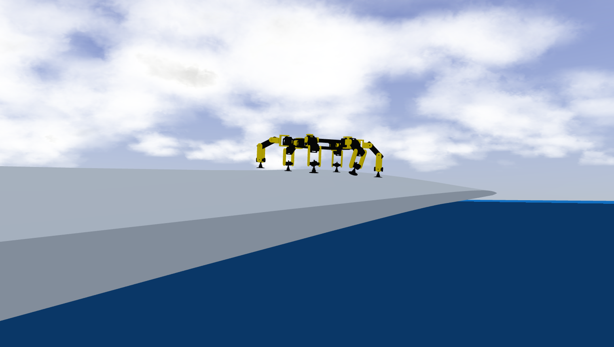
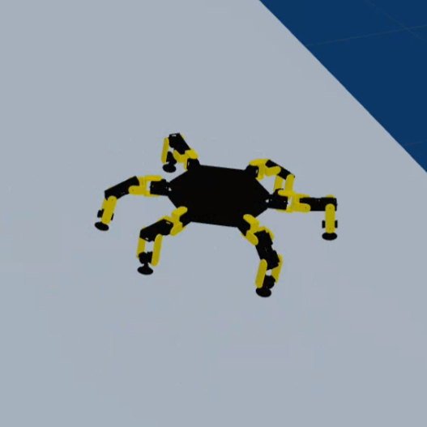
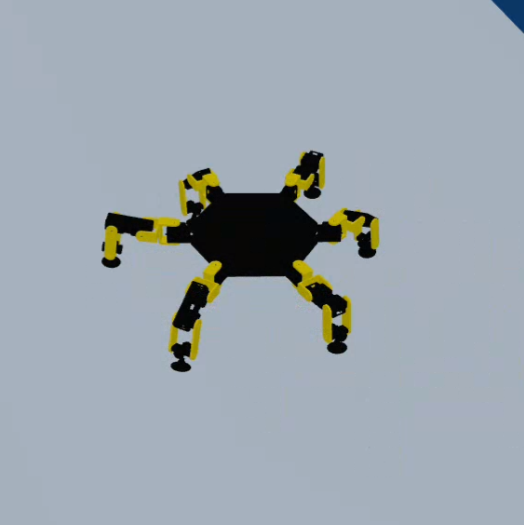
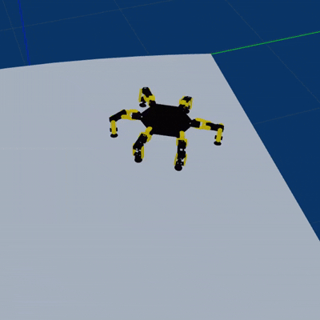
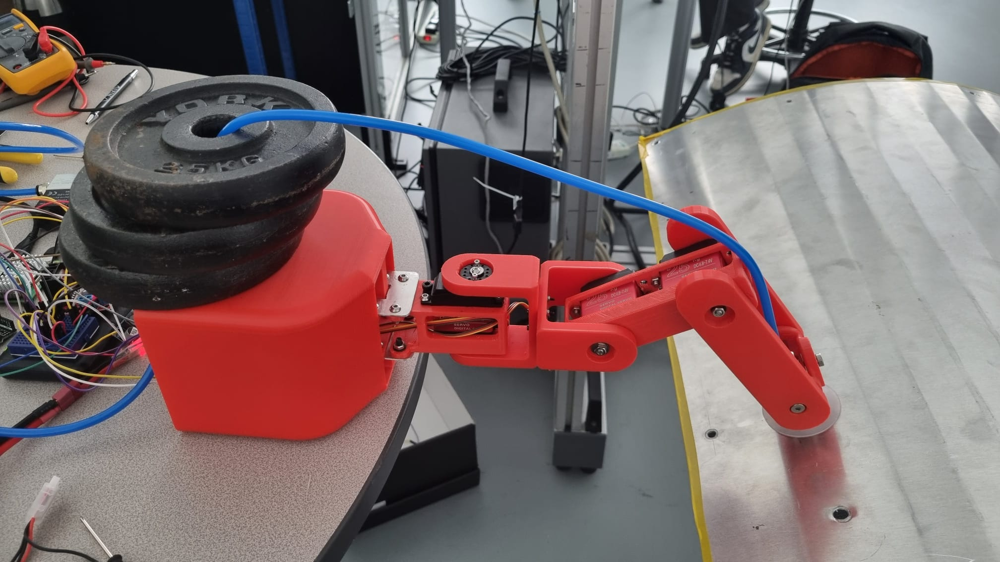

# Suction-Based Crawler for Wind Turbine Blade Inspection

<p align="center">
  
</p>

This repository contains the two software components developed to validate a suction-based crawler leg for wind turbine blade inspection. Two subfolders, two complementary validation efforts:

- **`simulation/`** — validates whole-robot coordination: can six legs execute a tripod gait and attach/detach in sync, in a physics simulator, before committing to hardware.
- **`prototype_trials/`** — validates the physical adhesion principle itself (real vacuum, real air leakage, real surface contact) on a single-leg hardware prototype.

Neither alone proves the full concept. The simulation's adhesion model is a physically ideal rigid joint with no air leakage, so it cannot validate whether suction actually holds on a real surface. The prototype is a single leg, not six, so it cannot validate whole-robot gait coordination or stability. Together they cover the two halves of the argument: simulation shows the six-leg gait logic works, and the physical rig shows the adhesion mechanism itself works. Bridging the two — a fully simulated *and* physically validated six-leg system — is future work.

---

## Requirements

- **`simulation/`**: ROS2 and Gazebo Classic (Gazebo 11), plus `colcon` for building the package.
- **`prototype_trials/`**: Python 3 on the Raspberry Pi, with `pyserial` (Arduino serial link), `pygame` (Xbox controller input), and `openpyxl` (writing trial results to `.xlsx`). An Arduino IDE (or equivalent) to flash the `.ino` firmware.

---

## `simulation/`

Full detail in `simulation/README.md`. Two packages:

- **`gait_and_adhesion`** — `assembly_with_links` (URDF, world, launch), `gait_control.py`, and a custom `hexapod_link_attacher` Gazebo plugin. This plugin was built from scratch because two existing off-the-shelf attachment plugins were unusable for this case: one only supports a single global attachment at a time, which can't represent three legs attaching independently during a tripod gait; the other proved unreliable in testing (see the simulation README for the debugging done). Adhesion is confirmed working correctly in isolated, single-leg testing, but intermittently stalls when running continuously alongside the full gait controller. This package is included specifically to document that attempt and the debugging trail, not as a fully working demo.
- **`gait_only`** — the same robot and gait controller, with the adhesion plugin fully removed. This is the reliable fallback: use it to see the tripod gait itself working cleanly, without the attachment reliability issue.

<p align="center">
  
</p>
<p align="center"><i>Phase 1 of the tripod gait: legs front-left, mid-right, and rear-left are lifted and swinging, while the other three legs remain planted and attached to support the body.</i></p>

<p align="center">
  
</p>
<p align="center"><i>Phase 2 of the tripod gait: the leg groups have switched roles — front-right, mid-left, and rear-right are now lifted and swinging, while the previously swinging legs are planted and attached.</i></p>

<p align="center">
  
</p>
<p align="center"><i>Continuous tripod gait cycle in Gazebo, showing the two leg groups alternating between the swing and stance phases shown above.</i></p>

Before running, make sure `gait_control.py` is located in your home folder (referenced by the launch file using a fixed path).

Run with:
```bash
cd ~/assembly_with_links
colcon build
source install/setup.bash
ros2 launch assembly_with_links gazebo_launch.py
```
Then, in a separate terminal:
```bash
python3 gait_control.py
```

---

## `prototype_trials/`

Single-leg hardware rig: Raspberry Pi 5 + Arduino (Elegoo UNO) + 3 servos + a 12V vacuum pump and normally-closed solenoid valve + a vacuum pressure sensor. The Pi reads an Xbox controller and sends single-character commands to the Arduino over a USB serial link; the Arduino handles real-time servo motion and sensor sampling, and streams sensor readings back to the Pi.

- **`spider_leg_keyboard_control.ino`** — Arduino firmware. Single-character serial protocol: `q/e`, `a/d`, `z/c` toggle joints 1–3 in each direction; `w/s/x` home them; `v`/`V` turns the vacuum on; `b`/`B` turns it off, with a 0.5 s valve-vent delay to release the seal cleanly; `?` requests a status report. Sensor voltage is streamed over serial every 200 ms.
- **`main.py`** — Raspberry Pi controller. Maps Xbox controller input to the Arduino's serial protocol as follows:
  - **Left stick, X-axis** — toggles Joint 1 (deflect past the deadzone in either direction to switch direction)
  - **Left stick, Y-axis** — toggles Joint 2
  - **Right stick, Y-axis** — toggles Joint 3
  - **X button** — homes Joint 1
  - **Y button** — homes Joint 2
  - **B button** — homes Joint 3
  - **A button** — toggles the vacuum on/off **and**, simultaneously, starts/stops experiment recording

  While vacuum is off, the script keeps a rolling baseline of the sensor voltage; while it's on, it logs voltage against time. On stopping a trial, it computes the average voltage drop, percentage drop, standard deviation, and stabilisation time, applies a pass/fail threshold (average hold voltage < 3.9 V = successful attachment), prompts the operator for trial conditions (surface material, payload weight, approach angle, curvature, wet/dry, induced failure), and appends one row to the results spreadsheet.
- **`instructions_prototype.txt`** — bench setup and operating checklist: power-up sequence, cabling order, and a first-use functional check to run before starting a trial session.
- **Spreadsheets** — auto-generated trial logs (raw data), one row per trial: `experiment_logs` for Series A (unloaded attachment/detachment), `payload_experiments.xlsx` for Series B (loaded payload-holding).

<p align="center">
  
</p>
<p align="center"><i>The assembled single-leg prototype mounted on the fixed test rig, with the suction cup end-effector in contact with a test surface sample.</i></p>

Before running, make sure `spider_leg_keyboard_control.ino` is uploaded to the Arduino board, and that `main.py` is located in the home folder on the Raspberry Pi 5.

Run with:
```bash
python3 main.py
```
